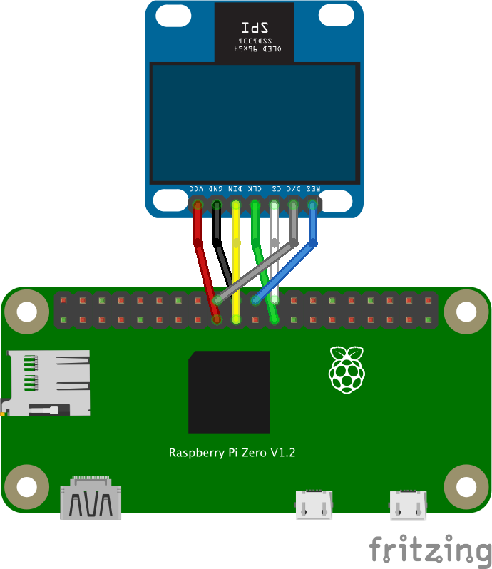

1. Enable SPI Interface on the Raspberry Pi
2. install and run pigopid http://abyz.me.uk/rpi/pigpio/download.html

3. Wiring to SPI connection



* Connect VCC to the power supply 
* Connect GND to the ground pin
* Connect DIN(,D1,SDA or MOSI) to GPIO 10 (MOSI)
* Connect CLK(,D0,SCL or Clock) to GPIO 11 (SCLK)
* Connect RES(Reset) to GPIO 25
* Connect DC(Data/Command) to GPIO 24
* Connect CS(Chip Select) to GPIO 8 (CE0)

<details><summary>SampleCode</summary><div>

Draw clock with [node-canvas](https://github.com/Automattic/node-canvas)
```ts
import { createCanvas, Canvas } from 'canvas'
import { Ssd1331 } from '@node-pigpio/devices-display'

const sleep = (msec: number): Promise<void> => {
    return new Promise((resolve) => setTimeout(resolve, msec))
}
const drawClock = (canvas: Canvas) => {
    const ctx = canvas.getContext('2d', { pixelFormat: 'RGB16_565' })

    // sample animation from https://developer.mozilla.org/en-US/docs/Web/API/Canvas_API/Tutorial/Basic_animations
    const now = new Date()
    ctx.save()
    ctx.scale(0.4, 0.4)
    ctx.clearRect(0, 0, 150, 150)
    ctx.fillStyle = 'white'
    ctx.fillRect(0, 0, 150, 150)
    ctx.translate(75, 75)
    ctx.scale(0.4, 0.4)
    ctx.rotate(-Math.PI / 2)
    ctx.strokeStyle = 'black'
    ctx.lineWidth = 8
    ctx.lineCap = 'round'

    // Hour marks
    ctx.save()
    for (let i = 0; i < 12; i++) {
        ctx.beginPath()
        ctx.rotate(Math.PI / 6)
        ctx.moveTo(100, 0)
        ctx.lineTo(120, 0)
        ctx.stroke()
    }
    ctx.restore()

    // Minute marks
    ctx.save()
    ctx.lineWidth = 5
    for (let i = 0; i < 60; i++) {
        if (i % 5 !== 0) {
            ctx.beginPath()
            ctx.moveTo(117, 0)
            ctx.lineTo(120, 0)
            ctx.stroke()
        }
        ctx.rotate(Math.PI / 30)
    }
    ctx.restore()

    const sec = now.getSeconds()
    const min = now.getMinutes()
    let hr = now.getHours()
    hr = hr >= 12 ? hr - 12 : hr

    ctx.fillStyle = 'black'

    // write Hours
    ctx.save()
    ctx.rotate(hr * (Math.PI / 6) + (Math.PI / 360) * min + (Math.PI / 21600) * sec)
    ctx.lineWidth = 14
    ctx.beginPath()
    ctx.moveTo(-20, 0)
    ctx.lineTo(80, 0)
    ctx.stroke()
    ctx.restore()

    // write Minutes
    ctx.save()
    ctx.rotate((Math.PI / 30) * min + (Math.PI / 1800) * sec)
    ctx.lineWidth = 10
    ctx.beginPath()
    ctx.moveTo(-28, 0)
    ctx.lineTo(112, 0)
    ctx.stroke()
    ctx.restore()

    // Write seconds
    ctx.save()
    ctx.rotate(sec * Math.PI / 30)
    ctx.strokeStyle = '#D40000'
    ctx.fillStyle = '#D40000'
    ctx.lineWidth = 6
    ctx.beginPath()
    ctx.moveTo(-30, 0)
    ctx.lineTo(83, 0)
    ctx.stroke()
    ctx.beginPath()
    ctx.arc(0, 0, 10, 0, Math.PI * 2, true)
    ctx.fill()
    ctx.beginPath()
    ctx.arc(95, 0, 10, 0, Math.PI * 2, true)
    ctx.stroke()
    ctx.fillStyle = 'rgba(0,0,0,0)'
    ctx.arc(0, 0, 3, 0, Math.PI * 2, true)
    ctx.fill()
    ctx.restore()

    ctx.beginPath()
    ctx.lineWidth = 14
    ctx.strokeStyle = '#325FA2'
    ctx.arc(0, 0, 142, 0, Math.PI * 2, true)
    ctx.stroke()

    ctx.restore()
}

(async () => {
    const ssd1331 = await Ssd1331.openDevice()
    await ssd1331.init()

    process.once('SIGINT', () => {
        (async () => {
            await ssd1331.close()
            process.exit()
        })()
    })

    const canvas = createCanvas(ssd1331.width, ssd1331.height)
    while (true) {
        drawClock(canvas)
        await ssd1331.draw(canvas.toBuffer('raw'))
        await sleep(1000)
    }
})()
```　

</div></details>