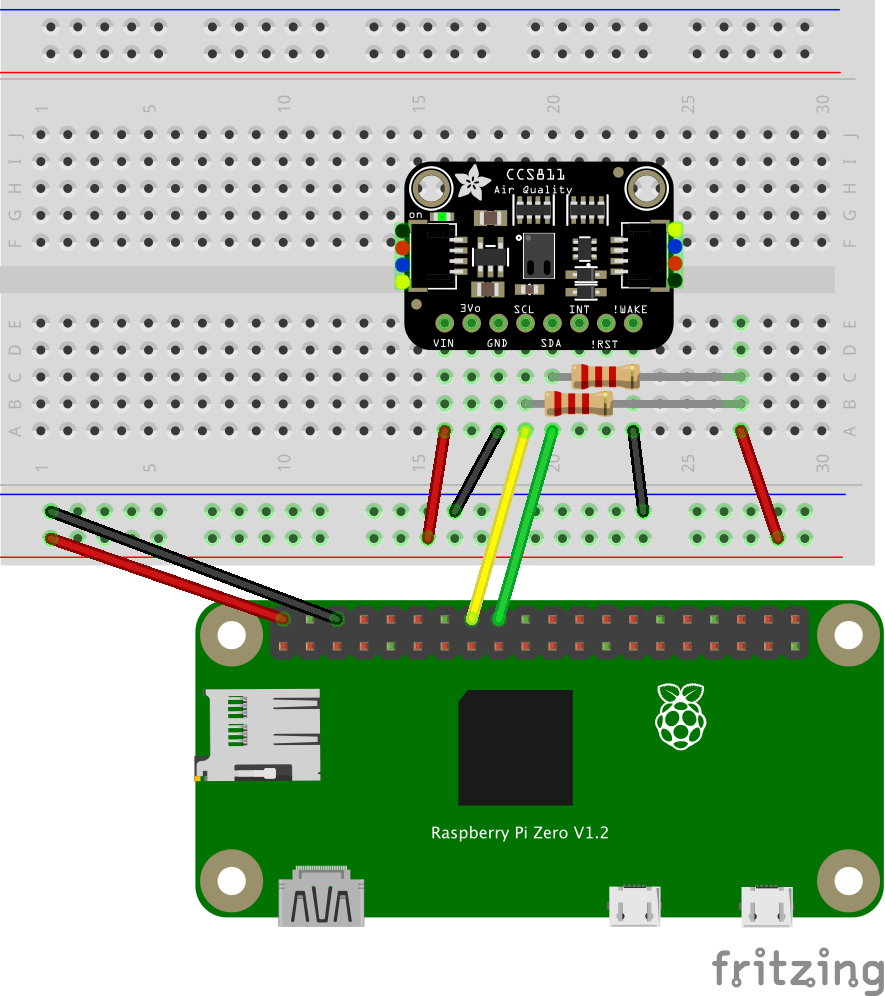

# Usage

This sensor connect with i2c but we need to slow the speed way down due to constraints of this sensor.

1. install and run pigopid http://abyz.me.uk/rpi/pigpio/download.html
2. Choose one of the connection methods
   - [Use Bit banging I2C](#Use-Bit-banging-I2C)
   - [Use system i2c](#Use-system-i2c)

## Use Bit banging I2C

- Connect Vin to the power supply
- Connect GND to the ground pin
- Connect SDA to 24(or your choice) with pullup register
- Connect SCL to 23(or your choice) with pullup register
- Connect Wake to the ground pin

Connect with pullup register


Example code

```ts
import { CCS811 } from '@node-pigpio/devices-sensor'
;(async () => {
  // Change address with your device
  const bbi2c = {
    i2cOption: { sda: 24, scl: 23, address: 0x5a, baudRate: 115200 },
  }
  const ccs811 = await CCS811(bbi2c)
  ccs811.on('data', (data) => {
    console.log(data)
  })
  ccs811.on('error', (err) => {
    console.log(err)
  })
  process.once('SIGINT', () => {
    void ccs811.close()
  })
})()
```

## Use system I2C

- Connect Vin to the power supply
- Connect GND to the ground pin
- Connect SDA to SDA
- Connect SCL to SCL
- Connect Wake to the ground pin

Change `i2c_baudrate` to 10000 by `/boot/config.txt` with reboot. Please search `i2c_baudrate raspberry pi`

```ts
import { CCS811 } from '@node-pigpio/devices-sensor'
;(async () => {
  // Change address with your device
  const ccs811 = await CCS811({ i2cOption: { bus: 1, address: 0x5a } })
  ccs811.on('data', (data) => {
    console.log(data)
  })
  ccs811.on('error', (err) => {
    console.log(err)
  })
  process.once('SIGINT', () => {
    void ccs811.close()
  })
})()
```
